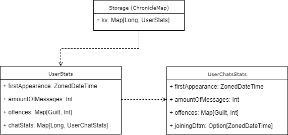

# Bot structure
Telegram (server) sends a stream of events to bot.
Library [telegrambot4s](https://github.com/mukel/telegrambot4s) splits it into several streams: messages, edited messages, commands, callbacks and so on.
As a result bot needs a separate process handler for each stream.
`Censoring` service is responsible for describing processes. There are two processes at now: `msgProcessing` and `callbackProcessing`.

`BotService` is responsible for telegram bot API.

Storage services.
* The first was `StatsService`. It keeps statistics about messages and infringements.
* `ChatSettingsService` is a new and just a mock. It was born when a need of separate options per chat became obvious.

### Description of `msgProcessing`
Process is applied to 'messages' and 'edited messages' streams only for groups and super groups.
```
val process =
      for {
        _       <- statCounter
        es      <- inquiry.searchEvidences
        verdict <- Judgement.judge(es)
        _       <- execution.punish(verdict)
        _       <- execution.notifyCourt(verdict)
      } yield verdict
```
1. Updates statistics.
2. Inspects event. Detects evidences.
3. Makes decision - Is a message suspicious?
4. Applies automatic punishment.
5. Notifies administrators and asks their will.

Stage 4 and stage 5 don't take in account a kind of guilt and restrict number of use cases.
It requires to rethink process.

#### 2. Search evidences
Looks for telegram links (via `@`) and web links (via `http:\\`).
Previous implementation searched all web links and utilized white list. False positive rate was too high.
Idea for a future implementation is a combination of black and white lists both for web and telegram links.

To add a new detector implement `InquiryProcedure` trait and append to list of procedures in `Inquiry` class.

#### 3. Judgement
Gathered on stage 2 facts are applied to list of rules. The result of application is user innocent or crime supposed.

At now a mere rule is a detection of evidences in messages of newcomers.

To add a new rule implement `Rule` trait and append to `Rule.codex` list.

#### 4. Punishment
Not implemented. Too risky. (small) Chance of false positive result exists but a way to rollback or notify administrators doesn't.

Can be utilized for other cases. For example to stop a sticker spam.

#### 5. Notify administration
Bot replies on suspicious message and mentions all of administrators.
If bot is administrator itself then it also displays buttons for fast execution.


### Description of `callbackProcessing`
ToDo

### Storage description
Bot needs statistics to make decisions about guilts. Statistics contains general counter of messages, counter of infringements and stats per chat. As storage ChronicleMap is used - extremely simple db with portable files.


`StatsService` class is responsible for datum writing and reading. Serialization and deserialization are implemented via protobuf 2.

At now bot uses [Chronicle-Map](https://github.com/OpenHFT/Chronicle-Map) as storage engine.
It's a simple and nice embedded KV.

# Run
Add 'application.conf' file to classpath with one parameter: `bot-token="token_of_your_bot"`. You can create and manage your bots via [Bot Father](https://telegram.me/botfather)

# Code style
Code style is absent right now. Merely scalafmt default settings because it's better than nothing.

# Additional notes
Bot'd been created as simple pet-project.
Some technologies had been integrated as experiments.
It'll be nice to remove or replace some of them, add unification for similar parts, give suitable names.
Performance doesn't matter when popularity is low.